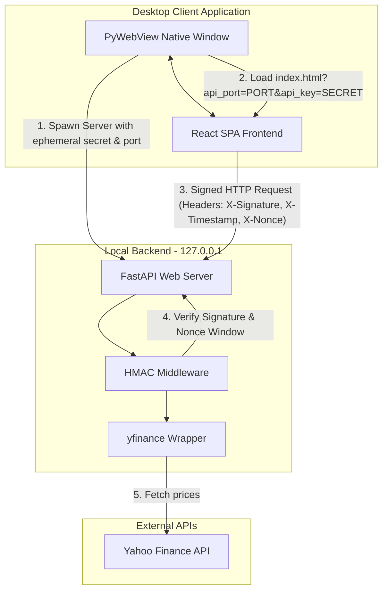

# NovaPortfolio Tracker

NovaPortfolio is a secure, standalone desktop application for tracking investment portfolios. It runs a local Python FastAPI backend proxy using `yfinance` to fetch market data, wrapped in a React frontend using `pywebview` for native window rendering.

---

## Architecture Diagram



---

## Security Model (HMAC-SHA256 Challenge-Response)

To prevent local loopback request eavesdropping and replay attacks, all communication between the React frontend and local FastAPI backend is signed using HMAC-SHA256:

1. **Ephemeral Key Generation**: On startup, `desktop.py` generates a random 32-byte hex key (`secrets.token_hex(32)`) and binds FastAPI to a random free loopback port on `127.0.0.1`.
2. **Key Transmission**: The key is passed once to the UI container via query parameters when loading the browser engine window (`?api_port=X&api_key=Y`).
3. **Request Signing**: For every API call, the frontend calculates:
   $$\text{Signature} = \text{HMAC-SHA256}(\text{Key}, \text{Method} + \text{Path} + \text{Timestamp} + \text{Nonce} + \text{Body})$$
   It transmits the signature, timestamp, and nonce in the headers (`X-Signature`, `X-Timestamp`, `X-Nonce`).
4. **Backend Verification**:
   - The backend validates the signature using the same shared key.
   - **Replay Protection**: The request is rejected if the timestamp is older than 15 seconds.
   - **Signature Reuse Prevention**: A database of used nonces is tracked; duplicate nonces within the valid time window are rejected.
   - **CORS & Preflight**: Standard preflight `OPTIONS` requests bypass signature validation as they carry no payload or state-changing operations.

---

## Functional Description

*   **Watchlist Management**: Add, track, and remove tickers. Supports search lookups utilizing an alias dictionary (e.g. typing "apple" resolves to `AAPL`, "walmart" to `WMT`).
*   **Live Market Data Proxy**: Leverages `yfinance` to bypass client CORS restrictions and fetch current prices, historical data, and fx rates.
*   **Performance & Growth Analytics**: Aggregates historical metrics to chart portfolio progression, visualizes asset allocation weights, and calculates growth statistics.
*   **Local Stash / Import**: Supports importing portfolio allocations via CSV templates.
*   **Cross-Platform Desktop Window**: Spawns inside a native Qt/PyQt6 web rendering container on Windows and macOS.

---

## Getting Started

### Prerequisites
*   Node.js (v20 or higher)
*   Python (3.11 or higher)

### Run in Development Mode (Split Backend/Frontend)

1. **Start the Backend Proxy**:
   ```bash
   cd backend
   python -m venv venv
   # Windows
   venv\Scripts\activate
   # macOS/Linux
   source venv/bin/activate

   pip install -r requirements.txt
   python main.py
   ```
   *Note: In development mode, mock keys or custom environment variables can be set (`NOVA_HMAC_KEY`).*

2. **Start the Frontend**:
   ```bash
   cd frontend
   npm install
   npm run dev
   ```

---

## Packaging the Desktop App

The application uses `build_desktop.py` to automate building the React assets, staging them inside the backend static directory, and calling PyInstaller to bundle them into executables.

### Build Executables Locally
Run the builder script from the root directory:
```bash
python build_desktop.py
```

This outputs two distributions in the `dist/` directory:
1.  **Folder Build** (`dist/NovaPortfolio/`): Contains the `.exe` (or macOS app binary) along with its dynamically linked libraries. It features faster launch startups.
2.  **Single-File Build** (`dist/NovaPortfolio-onefile.exe` or `dist/NovaPortfolio-onefile`): A packaged standalone executable. On startup, it extracts resources into a temporary directory.

---

## CI/CD Pipeline

A GitHub Actions workflow is defined in `.github/workflows/build.yml`.

- **On Pull Request & Push to `main`**: Automatically compiles the application on both `windows-latest` and `macos-latest` runners, generating zip archives for both distribution models.
- **On Release Tag (`v*.*.*`)**: Builds the binaries, compiles release notes, creates a new GitHub Release, and uploads the compiled Windows and macOS zip assets.
